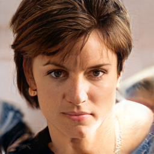
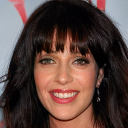
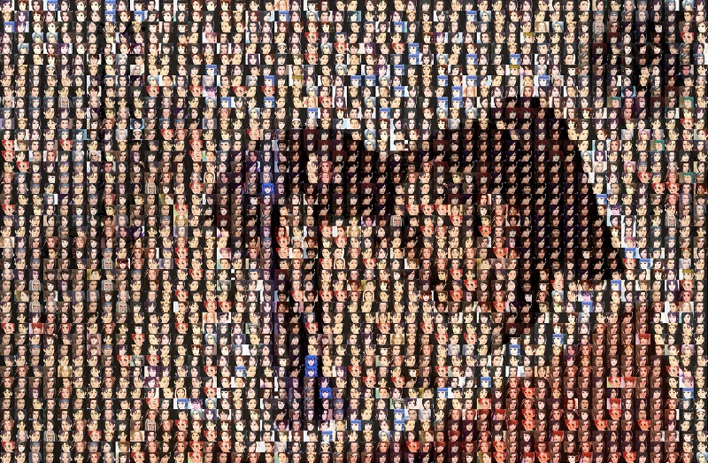
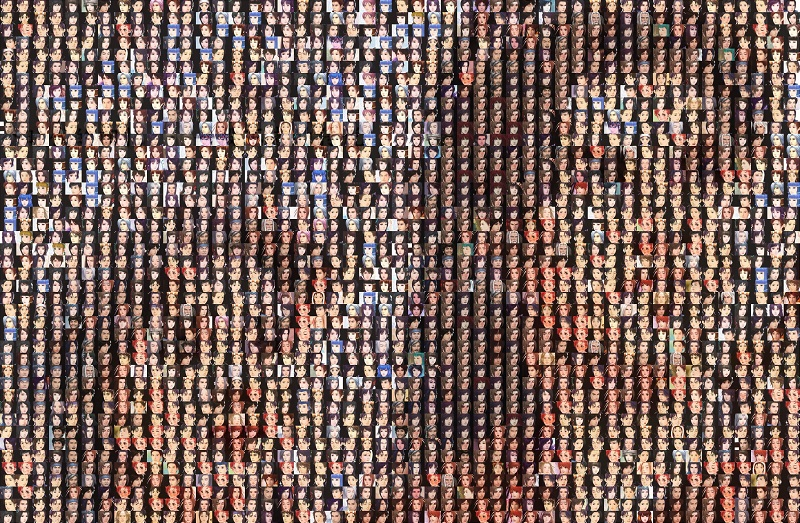
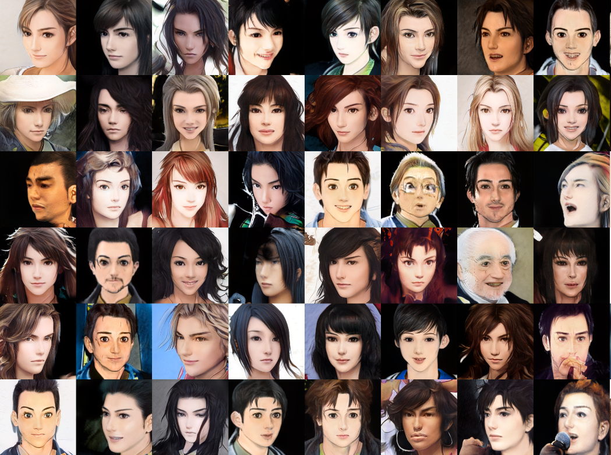
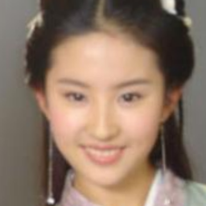
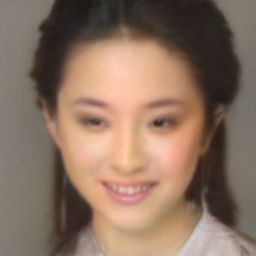
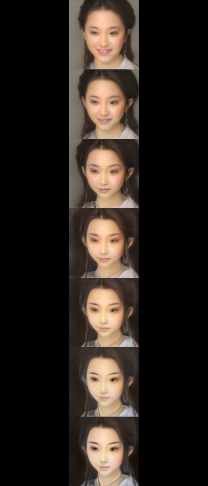

# toonify game character
仙剑奇侠传游戏人物角色风格<br>

[toonify](https://github.com/justinpinkney/toonify)作者使用基于**TensorFlow**实现的[stylegan2](https://github.com/justinpinkney/stylegan2)来完成人脸风格化。<br> 我本人更熟悉PyTorch深度学习框架，将原版作为参考，跑通基于**PyTorch**版的toonify

## 1.   熟悉stylegan2-ada-pytorch官方代码
```
git clone https://github.com/NVlabs/stylegan2-ada-pytorch.git

cd stylegan2-ada-pytorch
```
说明：NVidia在stylegan基础上改进的stylegan2，是目前生成质量最优的生成对抗模型<br>
‘ada’表示自适应可微分数据增强，可提升少样本训练的生成质量<br>

* 配置环境：本机配置为3090和cuda 11.1, 强烈建议按照官方介绍搭建docker环境，可参考以下命令：
    ```
    sudo docker pull nvcr.io/nvidia/pytorch:20.12-py3
    sudo docker run --ipc=host --gpus all -it -v `pwd`:/scratch --workdir=/scratch -e HOME=/scratch ad0f29ddeb63
    
    $ pip install imageio-ffmpeg==0.4.3 pyspng==0.1.0 dlib tensorflow
    ```


* 考虑到硬件成本，以及高清素材收集较困难，本项目使用**分辨率为256的celebahq预训练模型作为base_model**<br>
    以下命令自动执行模型下载，并生成以假乱真的人脸：
    ```
    python generate.py --outdir=out --trunc=1 --seeds=6-7    --network=https://nvlabs-fi-cdn.nvidia.com/stylegan2-ada-pytorch/pretrained/transfer-learning-source-nets/celebahq-res256-mirror-paper256-kimg100000-ada-target0.5.pkl
    ```
    <br>


* 对真实照片作编码获得最优风格潜码w等操作，可见官方文档介绍，此处不再赘述。
## 2.   训练数据的准备
- [x] 从网上搜集仙剑游戏人物素材（约300张）
- [x] 使用dlib作人脸对齐，相关实现有很多，比如[这里](https://github.com/rolux/stylegan2encoder/blob/master/align_images.py)<br>

    以下为训练集可视化展示
    <br>

    <br>
    注：为避免版权问题，将不放出这份训练集
## 3.   微调
- [x] 迁移学习，对base model进行微调，得到new model, 参考代码：
    ```
    python train.py --cfg paper256 --resume celebahq256 --outdir=./result --data=【your-training-dataset】.zip --mirror True --snap 8 --gpus=1 --target 0.5 --kimg 40 --augpipe custom --metrics pr50k3_full --freezed 10
    ```
    说明：在train.py源码的augpipe_specs处添加新的数据增强模式```'custom': dict(scale=1, xflip=1, noise=1)```<br>
    以上若干关键参数的选取，可在论文实验部分找到依据。<br>

    微调后的网络权重提供百度网盘下载，https://pan.baidu.com/s/1dYD8cCc75FMdntD9VCGF-g, 提取码 ```y1s1```。<br>
    
    随机生成样例：<br>
    <br>
    celebahq数据以欧美人为主，混搭仙侠风格多少有些违和感。<br>ps. 你也不能戴着眼镜穿越到仙侠世界，否则面部会产生量子纠缠、时空扭曲。
- [ ] 可以使用**亚洲人脸数据集**训练一个base model，再做迁移学习得到new model<br> 

## 4.实测
* 获得被测图片的风格编码w, 并生成重建图，这里使用[官方实现](https://github.com/NVlabs/stylegan2-ada-pytorch/blob/main/projector.py)，观察到，重建前后id信息改变较大<br>
    <br>
toonify作者推荐使用第三方实现[Stylegan\Stylegan2 Encoder](https://github.com/rolux),据说效果更好一些，未验证。<br>
    编码使用优化方法，基于图像特征差异提供的梯度迭代优化，找到最优w，存在误差，不像可逆流模型如Glow等可对真实人脸作无损的编码和重构。

- [x] 模型混合<br>
    没有什么可介绍的，pytorch版代码很简单，根据resolution融合两个模型的权值。<br>这里风格映射网络据说区别不大，直接用base model的就行。

* 不同层级 (分辨率[4,8,16,32,64,128,256]) 模型混合，可视化结果展示<br>
<br>

## 5.可能的改进
- [ ] pix2pix<br>
    stylegan2照片编码过程是很慢的！需要迭代成百上千次，实际使用自然需要更快速地风格迁移方法。<br>这里可以制作成对的真实人脸-游戏人物风格图片pairs,训练一个轻量化的pix2pix模型, inference会在很大程度上得到简化和加速。<br>

- [ ] StyleFlow<br>
    流模型与GAN结合，提高图片编码、重建、属性变换的精度。

## Citation
```
@article{Karras2019stylegan2,
  title   = {Analyzing and Improving the Image Quality of {StyleGAN}},
  author  = {Tero Karras and Samuli Laine and Miika Aittala and Janne Hellsten and Jaakko Lehtinen and Timo Aila},
  journal = {CoRR},
  volume  = {abs/1912.04958},
  year    = {2019},
}

@inproceedings{Karras2020ada,
  title     = {Training Generative Adversarial Networks with Limited Data},
  author    = {Tero Karras and Miika Aittala and Janne Hellsten and Samuli Laine and Jaakko Lehtinen and Timo Aila},
  booktitle = {Proc. NeurIPS},
  year      = {2020}
}

@unknown{unknown,
author = {Pinkney, Justin and Adler, Doron},
year = {2020},
month = {10},
pages = {},
title = {Resolution Dependant GAN Interpolation for Controllable Image Synthesis Between Domains}
} 
```
